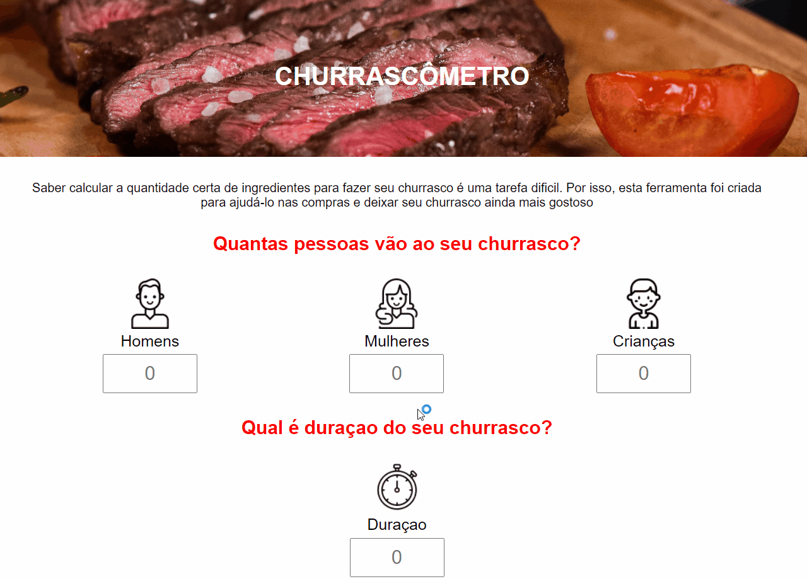

<h1 align="center">Churrascômetro   </h1>

 
 

  

 
    <a href="https://fernandoaugustodev.github.io/churrascometro" target="_blank" >Veja o Projeto</a>

## 💻 Sobre o Projeto
 

ⱠSaber calcular a quantidade certa de ingredientes para fazer seu churrasco é uma tarefa dificil. Por isso, esta ferramenta foi criada para ajudá-lo nas compras e deixar seu churrasco ainda mais gostoso

 

## ⚙️ Funcionalidades

- ✅ Calcula quantidade de carne por pessoa (sendo 400 gramas de carne para Homem, 320 gramas para Mulher e cada criança 200 gramas) para eventos menores de 6 horas
- ✅ Calcula quantidade de carne para evento superior a 6 horas 
- ✅ Calcula quantidade de bebidas separadas por garras e caixas para eventos menor de 6 horas e superior a 6 horas

---

## 🛠 Techs

Tecnologias usadas neste projeto

- HTML
- CSS
- JavaScript

---

## 👨🏼‍💻 Autor

Fernando Augusto 

 
  
 
© 2021 GitHub, Inc.
Terms Privacy Security Status Docs
